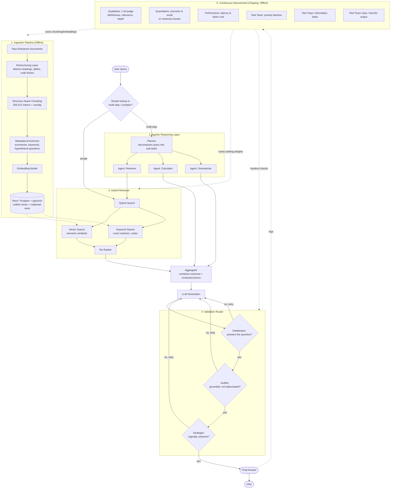

## 1. What RAG Is Actually Solving

**The core problem:** LLMs are trained on public internet data — they know nothing about _your_ private documents. **Retrieval-Augmented Generation (RAG)** fixes this by fetching relevant context from your own data and handing it to the model before it answers, instead of retraining the model itself.

**Why it's attractive:** No multi-million-dollar retraining runs. Just a good search mechanism plus a clean way to feed context to the LLM.

**The catch — and it's a big one:** A recent Google Research study found that bad retrieval doesn't just fail silently. When an LLM is fed _wrong_ context, it doesn't hedge or say "I don't know" — it gets **more confident and hallucinates more** than if it had received no context at all.

> **Takeaway:** Bad retrieval is worse than no retrieval. Getting retrieval right isn't a nice-to-have — it's the whole game.

---

## 2. Demo RAG vs. Production RAG

**In a demo:** documents are clean, questions are predictable, and the basic pipeline (embed → search → retrieve → generate) just works.

**In production:** enterprise data is a mess — scanned tables, headers and footers, multiple document versions floating around. Two failure modes show up constantly:

- **Outdated retrieval** — the system pulls a 2019 policy because the keywords match, with no idea it's been superseded twice since.
- **Truncated context** — naive chunking slices a sentence in half or turns a structured table into word soup, feeding the LLM garbage.

_In short: the pipeline that works in a notebook doesn't survive contact with real documents._

---

## 3. Fixing the Data Before It Reaches the Database

Good retrieval starts long before search — it starts with how you process documents on the way in.

- **Restructuring layer:** Instead of just yanking raw text, this layer understands document _semantics_ — what's a heading, a paragraph, a table, a code block.
- **Structure-aware chunking:** No more arbitrary 500-token cuts. Chunks respect natural boundaries — a heading stays glued to its paragraph, a function doesn't get sliced in half. The **sweet spot is 256–512 tokens per chunk**, with overlap to preserve context across boundaries.
- **Rich metadata per chunk:**
    - _Summaries & keywords_ — a quick "what is this chunk about."
    - **Hypothetical questions (the real pro-tip):** use an LLM to generate the questions a chunk could answer. Now retrieval matches _question-to-question_ instead of _question-to-random-paragraph_ — a surprisingly large accuracy boost for very little extra work.

---

## 4. Rethinking the Database

**Why pure vector databases fall short:** production queries constantly need relational filtering — "documents from Q3," "only HR policies," "chunks from the same source doc joined together." Vector similarity alone can't do that well.

**The fix:** use a relational database with native vector support instead of a vector-only store. The example highlighted is **Neon** (serverless Postgres + `pgvector`).

What that buys you:

- **Unified queries** — semantic search and relational filters (e.g. filter by date) in one query, not two separate systems bolted together.
- **Scale-to-zero:** costs nothing when idle, spins up in milliseconds under load.
- **Database branching:** essentially _Git for your database_ — clone your production knowledge base instantly to test a new chunking or embedding strategy without touching prod.

---

## 5. Smarter Retrieval: Hybrid Search + Re-ranking

Users don't phrase things the way your documents do. **Hybrid search** covers both angles:

- **Vector search** — catches semantic meaning, even with different wording.
- **Keyword search** — catches exact matches vectors tend to miss, like product names or error codes.

After both return candidates, a **re-ranking** step reorders them so the most genuinely relevant chunks rise to the top before they ever reach the LLM.

---

## 6. When One Retrieval Isn't Enough: Agentic RAG

Some questions — _"Compare Q3 performance in Europe vs. Asia and recommend where to focus next quarter"_ — can't be answered by a single retrieval call. This is where a **reasoning layer** comes in:

- **The Planner:** intercepts the query first and breaks it down — what distinct pieces of information are needed, what steps to take, which tools to call.
- **Multi-agent coordination:** specialized agents split the work — one retrieves financial data, another runs the calculations, another summarizes — and their outputs are combined into a single coherent answer.

---

## 7. Before the User Sees an Answer: Validation Nodes

Agentic systems have more moving parts, which means more ways to go wrong. A conditional router runs each generated answer through three checks before release:

|Validator|What it checks|
|---|---|
|**Gatekeeper**|Does this response actually answer the original question?|
|**Auditor**|Is this strictly grounded in the retrieved context — or hallucinated?|
|**Strategist**|Does this hold together logically in the broader context?|

---

## 8. Measuring Whether It's Actually Working

A RAG system can fail silently for weeks without proper evaluation. Three lenses matter:

- **Qualitative** — "LLM judges" score faithfulness (is it grounded?), relevance, and depth.
- **Quantitative** — precision and recall on whether the _right_ chunks were retrieved in the first place.
- **Performance** — latency and token cost, which matter enormously once you're operating at scale.

---

## 9. Breaking It on Purpose: Red Teaming

Before real users touch the system, deliberately try to break it:

- **Prompt injection** — can someone talk the system out of its instructions?
- **Information leaks** — can it be tricked into surfacing data it shouldn't?
- **Bias / harmful outputs** — does it degrade under adversarial framing?

**The goal:** find the cracks yourself, before your users — or your stakeholders — find them for you.

---

### The One-Line Summary

A demo RAG system is: _embed → search → generate._ A production RAG system is: _clean ingestion → hybrid retrieval → agentic reasoning → validation → evaluation → red-teaming_ — with each layer existing because the layer before it isn't enough on its own.

